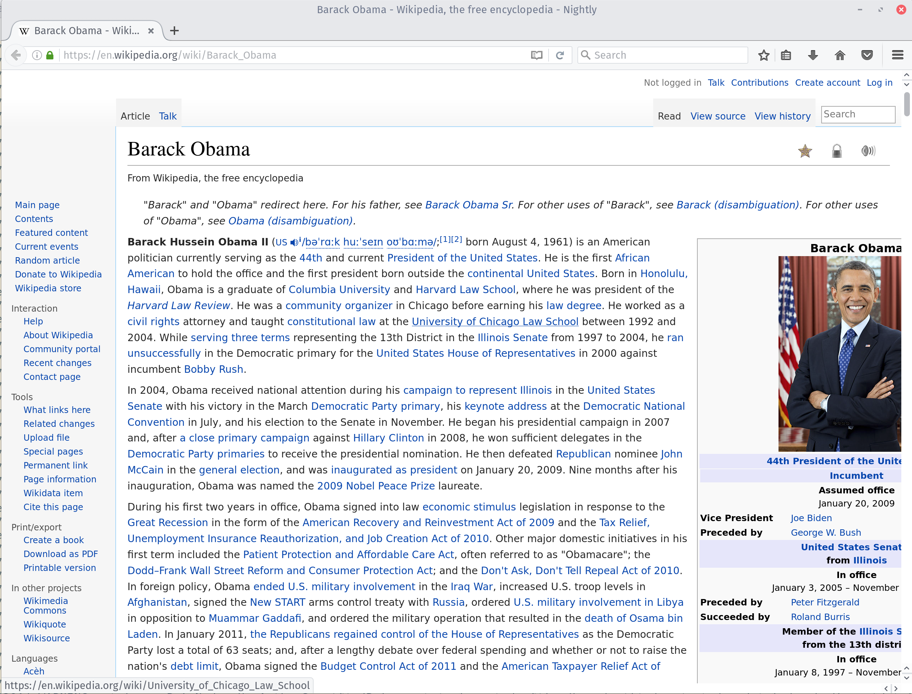
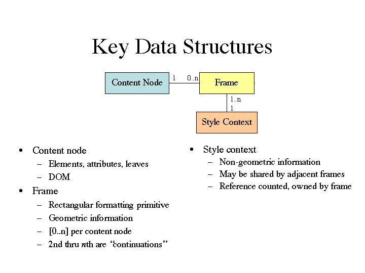

# `about:emilio`

 * Undergrad student at University of Salamanca (Spain).
 * Servo contributor from more than a year (WebGL, style, layout...)
    * I review stuff, sometimes (sorry for the delays!).
    * Also maintain and improve Servo's fork of rust-bindgen.
 * Platform intern.

---

# Stylo

 Integrating Servo's style system, written in Rust, inside Gecko.

---



---

# Motivations

---

## Rust


 * New systems programming language, born at Mozilla.
   * More safety guarantees than C++, without compromising performance.
   * No data races.

---

## Servo


 * Next generation web-browser engine, designed for modern language.

---

# Challenges

## Language boundaries

  * Crossing language boundaries in performance-critical code is not an easy
  problem.

  * We generate equivalent-layout struct types to avoid crossing FFI boundaries
  for everything.

---

### An example

```rust
#[repr(C)]
pub struct nsStyleImageLayers {
    pub mAttachmentCount: u32,
    pub mClipCount: u32,
    pub mOriginCount: u32,
    pub mRepeatCount: u32,
    pub mPositionXCount: u32,
    pub mPositionYCount: u32,
    pub mImageCount: u32,
    pub mSizeCount: u32,
    pub mMaskModeCount: u32,
    pub mBlendModeCount: u32,
    pub mCompositeCount: u32,
    pub mLayers: nsStyleAutoArray&lt;nsStyleImageLayers_Layer&gt;,
}
```

---

## Different styling models

  * Servo uses the content tree (DOM), each node owns its computed values, and
  its pseudo elements', that may be shared via refcounting.

  * Gecko has multiple trees (Content, Frame, Rule, Style context). Each content
  can have zero or N frames, frame owns the style context, that owns computed
  values.

---

### Gecko's layout model



---

### Current approach

  * Right now we do a pass after the parallel traversal attaching the style
  contexts to the appropriate frames.

  * Nice for simplicity while developing, but we might want to refactor it
  (there are plans here).

---

# Other stuff I did

  Worked on a total of 30 Bugzilla bugs, submitted 40 PRs for `servo/servo`, and
  reviewed 65 of them.

---

# People I need to thank for making my summer awesome.

  * Bobby, Cameron, and all the Stylo team (they're great!).
  * Daniel Holbert, Andrew McCreight, Bill McCloskey.
  * All the MV interns (esp. Leo, Michael, Rob, Ryan).
  * The University team.
  * Boris and David Baron, for all their insight in different parts of the
  platform.
